# Report — Assignment 2: Data Structures

**Name:** Nurasyl Zhambyl
**Group:** SE-2518
**GitHub repository:** https://github.com/nurasylzhambyl06-droid/daa-assignment2

## 1. Complexity Table

Auxiliary space is extra memory used beyond the n stored elements themselves.

| Structure | Operation | Best | Average | Worst | Justification |
|---|---|---|---|---|---|
| **DynamicArray** | `add(x)` | O(1) | O(1) amortized | O(n) | Worst case hits when the backing array is full and must be doubled + copied; amortized over many calls this averages to O(1) |
| | `add(index, x)` | O(1) | O(n) | O(n) | Inserting at the end needs no shift; inserting near the front shifts almost every element after it |
| | `remove(index)` | O(1) | O(n) | O(n) | Removing the last element needs no shift; removing near the front shifts almost every element after it |
| | `get(index)` | O(1) | O(1) | O(1) | Direct address computation — no input makes this slower |
| | `contains(x)` | O(1) | O(n) | O(n) | Best case: x is the first element. Worst case: x is absent, or is the last element — the whole array must be scanned |
| | **Auxiliary space** | O(n) | | | Just the backing array; no per-element overhead beyond the ints themselves |
| **MyLinkedList** | `add(x)` | O(1) | O(1) | O(1) | Tail pointer means appending never requires traversal, regardless of list size |
| | `add(index, x)` | O(1) | O(n) | O(n) | Inserting at index 0 is immediate; any other index requires walking the pointer chain to get there first |
| | `remove(index)` | O(1) | O(n) | O(n) | Same reasoning as add(index, x) — removing the head is immediate, anything else needs traversal |
| | `get(index)` | O(1) | O(n) | O(n) | Best case: index 0. No random access exists — every other index requires walking from head |
| | `contains(x)` | O(1) | O(n) | O(n) | Same shape as DynamicArray's contains, but each "step" is a pointer hop instead of an array-index increment |
| | **Auxiliary space** | O(n) | | | One Node object per element — each carries an object header plus a next-pointer, on top of the int value itself |
| **MinHeap** | `insert(x)` | O(1) | O(log n) | O(log n) | Best case: new element is already >= its parent, no bubble-up needed. Worst case: it must bubble all the way to the root, a path of length log n (the heap's height) |
| | `peekMin()` | O(1) | O(1) | O(1) | The minimum is always at index 0 by the heap invariant — no search needed |
| | `extractMin()` | O(log n) | O(log n) | O(log n) | Always moves the last element to the root and bubbles it down; the path length is bounded by the heap's height, log n, in every case |
| | `buildHeap(array)` (bonus) | O(n) | O(n) | O(n) | Floyd's method: most nodes are near the bottom of the tree and need little or no sinking — the total work sums to O(n), not O(n log n) (see Bonus Task B below) |
| | **Auxiliary space** | O(n) | | | A single backing array, same as DynamicArray — no per-node object overhead |

## 2. Loop Invariant Proofs

### Proof 1 — `contains(x)` in DynamicArray

```java
public boolean contains(int x) {
    for (int i = 0; i < size; i++) {
        if (array[i] == x) {
            return true;
        }
    }
    return false;
}
```

**Invariant:** At the start of each iteration with index `i`, none of the elements `array[0..i-1]` are equal to `x`.

**Initialization:** Before the first iteration, `i = 0`. The claim "none of `array[0..-1]` equal x" refers to an empty range, so it is vacuously true — there is nothing to check yet.

**Maintenance:** Assume the invariant holds before iteration `i` (i.e. `array[0..i-1]` contains no occurrence of x). During the iteration, we check `array[i] == x`:
- If true, the method returns `true` immediately — the loop ends, so maintenance for a "next iteration" is not needed.
- If false, we now additionally know `array[i] != x`. Combined with the assumption, `array[0..i]` contains no occurrence of x — which is exactly the invariant for the next iteration, `i+1`.

**Termination:** The loop ends in one of two ways:
- Via `return true` inside the loop — correct, since we just confirmed `array[i] == x`.
- Via the loop condition `i < size` becoming false (`i == size`) — by the invariant, `array[0..size-1]` (the entire array) contains no occurrence of x, so returning `false` is correct.

**Conclusion:** Since the invariant holds before the first iteration (Initialization), is preserved by every iteration (Maintenance), and yields the correct answer however the loop terminates (Termination), `contains(x)` is correct for every possible input array and value of x.

### Proof 2 — `bubbleDown` in MinHeap

```java
private void bubbleDown(int index) {
    while (true) {
        int left = 2 * index + 1;
        int right = 2 * index + 2;
        int smallest = index;

        if (left < size && data[left] < data[smallest]) smallest = left;
        if (right < size && data[right] < data[smallest]) smallest = right;

        if (smallest == index) break;
        swap(index, smallest);
        index = smallest;
    }
}
```

**Invariant:** At the start of each iteration, the subtree rooted at `index` satisfies the heap property everywhere *except possibly at `index` itself* — every node in that subtree other than the root may still violate `parent <= child` only with respect to the current `data[index]`, but both subtrees hanging below `index`'s immediate children are already valid heaps.

**Initialization:** Before the first iteration, `index` is the position whose value was just overwritten (the old root, during `extractMin`, now holds whatever was previously the heap's last element). Both its children (if any) were already roots of valid heaps before this overwrite, since the rest of the structure was untouched. So the invariant holds: everything below is valid, only `index` itself might violate the property.

**Maintenance:** Assume the invariant holds before an iteration. The loop finds `smallest` — whichever of `index`, `left`, and `right` currently holds the smallest value (comparisons are counted here). If `smallest == index`, the loop breaks (handled under Termination). Otherwise, we swap `data[index]` with `data[smallest]`. This swap fixes the relationship between the old `index` and its two children — both children are now >= the value that moved into `index`'s old position. The value that moved down to `smallest` might still be larger than smallest's own children, but by the invariant's assumption, smallest's subtree (below smallest) was already a valid heap before the swap, and the swap only replaced smallest's own value — the same "might violate only at this one node" situation, now relocated to `index = smallest`. So the invariant holds again for the next iteration, with the new `index`.

**Termination:** The loop exits when `smallest == index`, meaning `data[index]` is already <= both its children (or has no children). By the invariant, everything below `index` was already a valid heap, and now `index` itself also satisfies the property relative to its children — so the entire subtree rooted at the *original* starting index is now a valid heap (each swap only ever pushed the "possible violation" one level deeper, and it has just been resolved).

**Conclusion:** Since the invariant holds when bubbleDown is first called (Initialization), is preserved by every iteration (Maintenance), and guarantees a fully valid heap once the loop stops (Termination), `bubbleDown` correctly restores the heap property after the root is replaced — which is exactly what `extractMin` relies on.

## 3. Plots

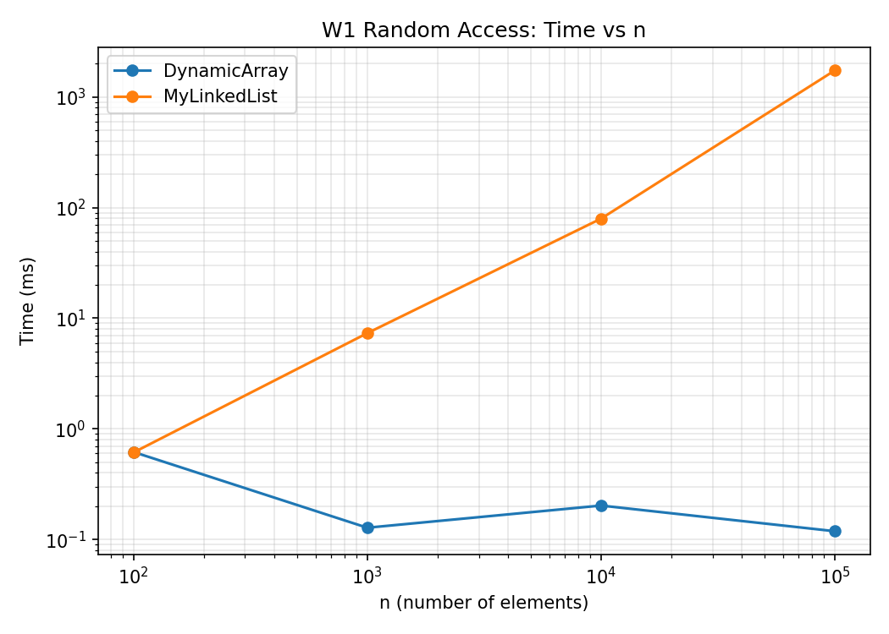

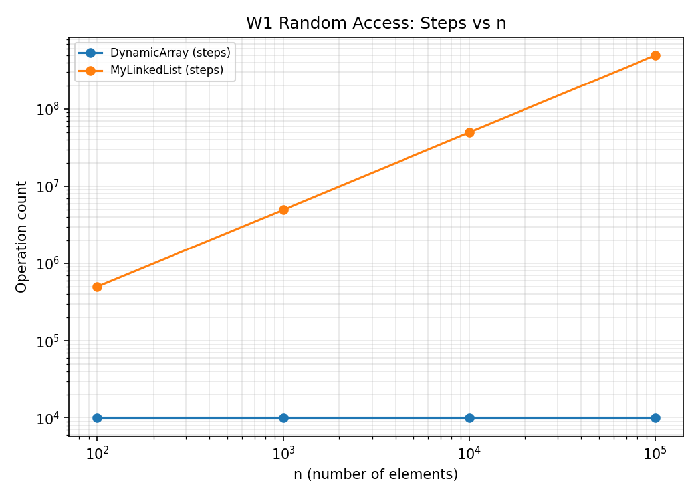

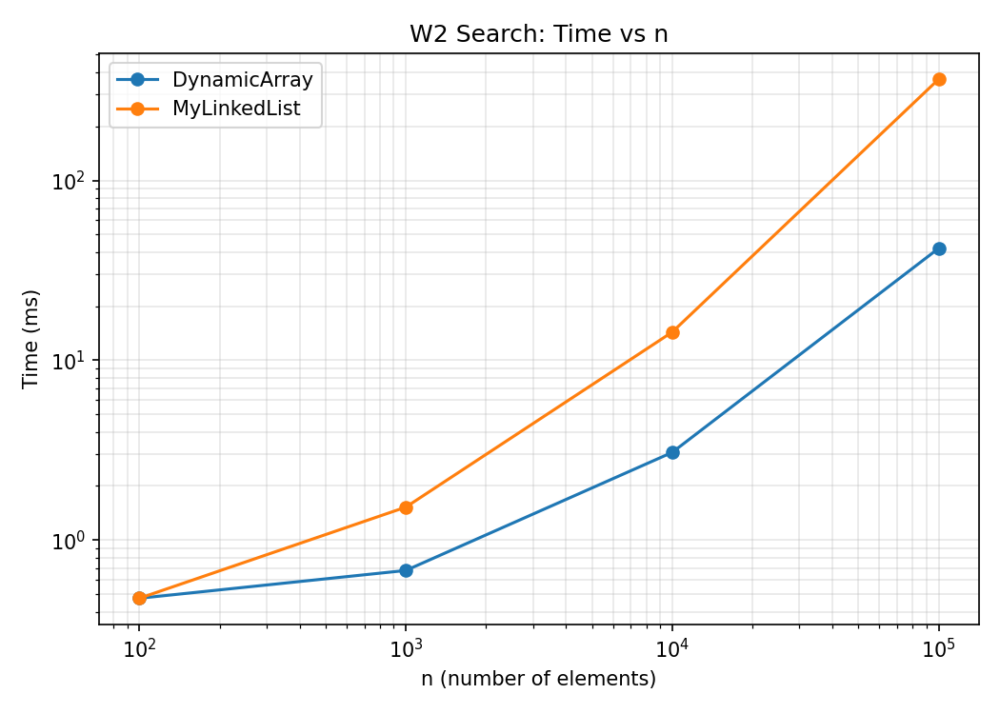

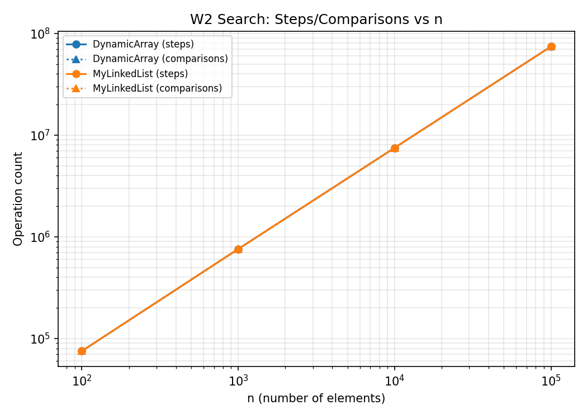

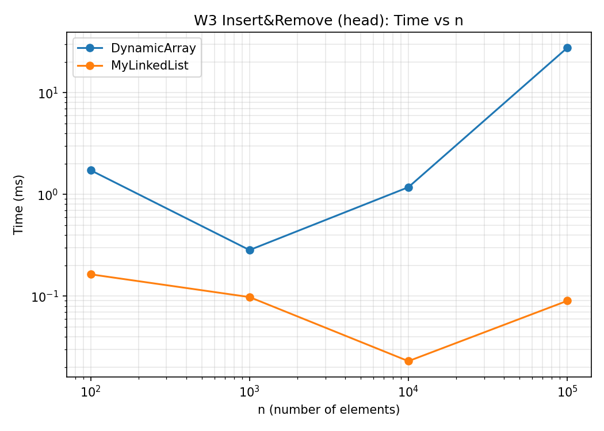

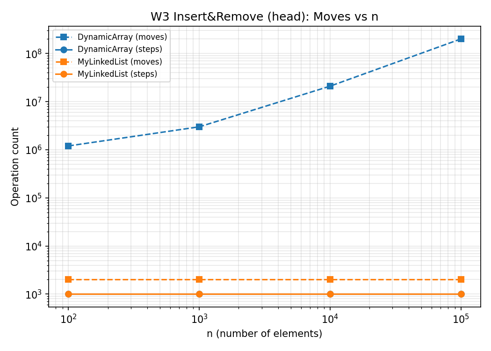

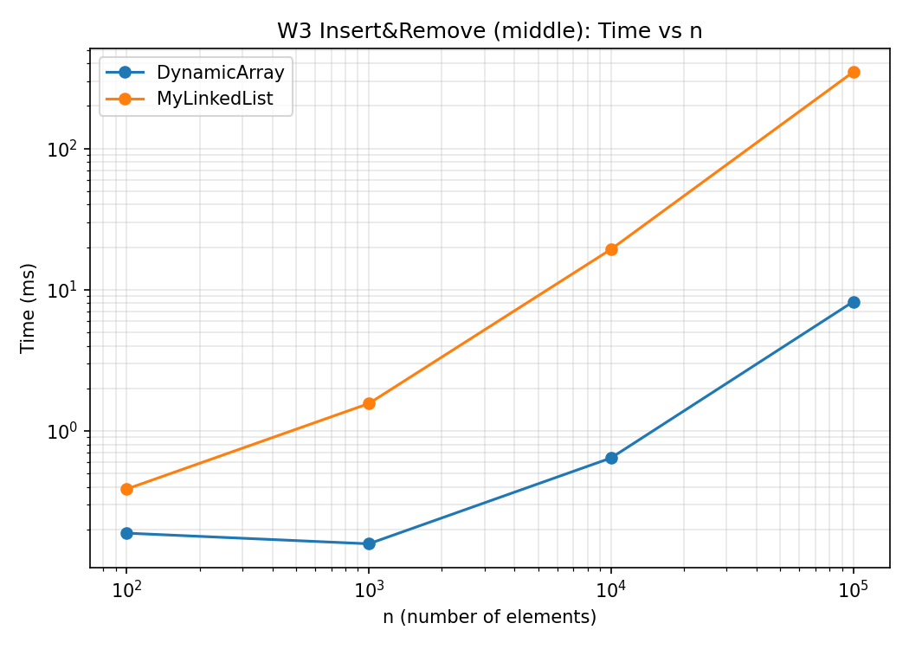

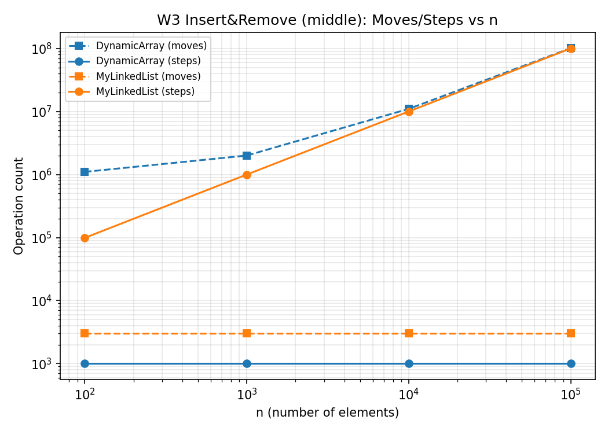

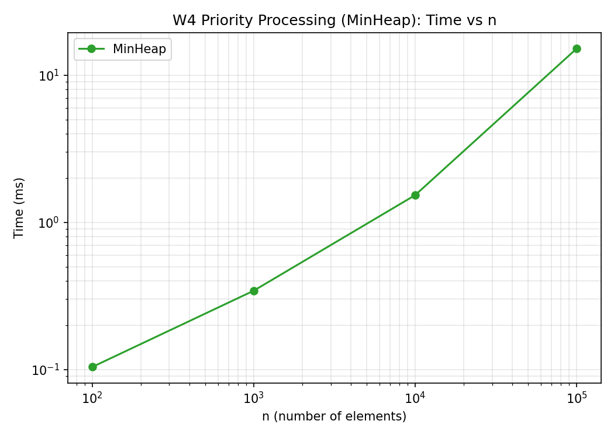

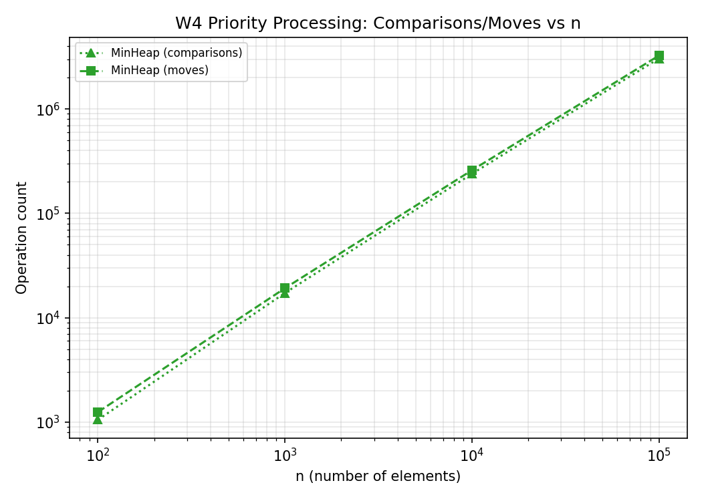

## 4. Discussion

My measurements line up with the theory in most cases, and in a couple of
places they revealed something the Big-O analysis alone wouldn't have
predicted.

**Cache locality (why DynamicArray wins at get and even at plain scanning):**
W1 makes the gap unmistakable. DynamicArray's get() stays essentially flat
across every n (0.12-0.62ms for 10,000 calls, regardless of whether n is 100
or 100,000) — exactly what O(1) direct indexing should look like. MyLinkedList
grows from 0.61ms at n=100 to 1735ms at n=100,000: a roughly 2,800x slowdown
for a 1,000x increase in n, worse than even a plain linear O(n) estimate would
suggest, because every single hop in the list is a jump to a essentially
random address on the heap, defeating the CPU's prefetching. DynamicArray's
elements sit in one contiguous block, so reading index i brings nearby indices
into the cache line "for free" — sequential or semi-random access inside that
block barely costs more than the first read.

**Pointer chasing (why the list can be slower even with the identical step
count):** W2 is the cleanest evidence for this. For every n, DynamicArray and
MyLinkedList performed exactly the same number of steps and comparisons (e.g.
74,253,877 each at n=100,000) — contains() scans linearly in both, so the
theoretical work is identical. Yet the measured time differs by 8.7x at
n=100,000 (41.9ms vs 365.2ms). Since the step count is literally equal, the
gap can only come from how expensive each step is physically: DynamicArray's
steps are sequential reads inside one cached block, while MyLinkedList's steps
are pointer dereferences to scattered Node objects — each one a likely cache
miss, plus the extra indirection of reading through an object header rather
than a raw value.

**When MyLinkedList is the better choice:** W3-head shows this decisively.
MyLinkedList's head insert/remove costs stay fixed at exactly 2,000 moves
regardless of n (0.02-0.16ms total), because both operations are O(1) — just
repointing the head. DynamicArray, by contrast, must shift almost the entire
array on every head insert/remove, and its move count grows with n
accordingly (1.2M moves at n=100 up to 201M at n=100,000), pushing its time up
to 27.6ms at the largest size — roughly 300x slower than the list for the
exact same workload.

**An unexpected reversal in W3-middle:** I didn't predict this going in — at
n=100,000, DynamicArray (8.2ms) actually beat MyLinkedList (347.7ms) for
middle insert/remove, even though both are nominally O(n) there. The
difference is again cache behavior rather than operation count: DynamicArray
shifts memory that's already contiguous and already in cache, which is cheap
per element, while MyLinkedList has to traverse ~n/2 pointer hops just to
reach the middle before it can even do the O(1) link update — and each of
those hops pays the same pointer-chasing cost as in W1/W2. So for this
specific workload, the list's traversal cost ends up outweighing the array's
shifting cost, flipping the intuitive expectation.

**MinHeap (W4):** time grows from 0.1ms at n=100 to 15.1ms at n=100,000, while
comparisons grow from about 1,000 to 3.06 million (~2,920x) — closer to the
expected n log n growth than the raw time figures suggest, which I attribute
to JVM warm-up dominating the very small n=100 case rather than the algorithm
actually becoming relatively faster at scale.

**General anomalies:** the smallest sizes (n=100, and some n=1,000 cases) show
timings that don't scale cleanly with the larger-n trend — e.g. MyLinkedList's
W2 time goes from 0.48ms (n=100) to 1.53ms (n=1,000), a jump that looks small
relative to the 7.5x growth in n. This is consistent with JIT/JVM warm-up:
even after discarding the first run, the remaining five measured runs at very
small n still complete fast enough that per-call overhead (method dispatch,
timer precision) can outweigh the actual algorithmic work being measured.

## 5. Bonus Task A — Memory Footprint (JOL)

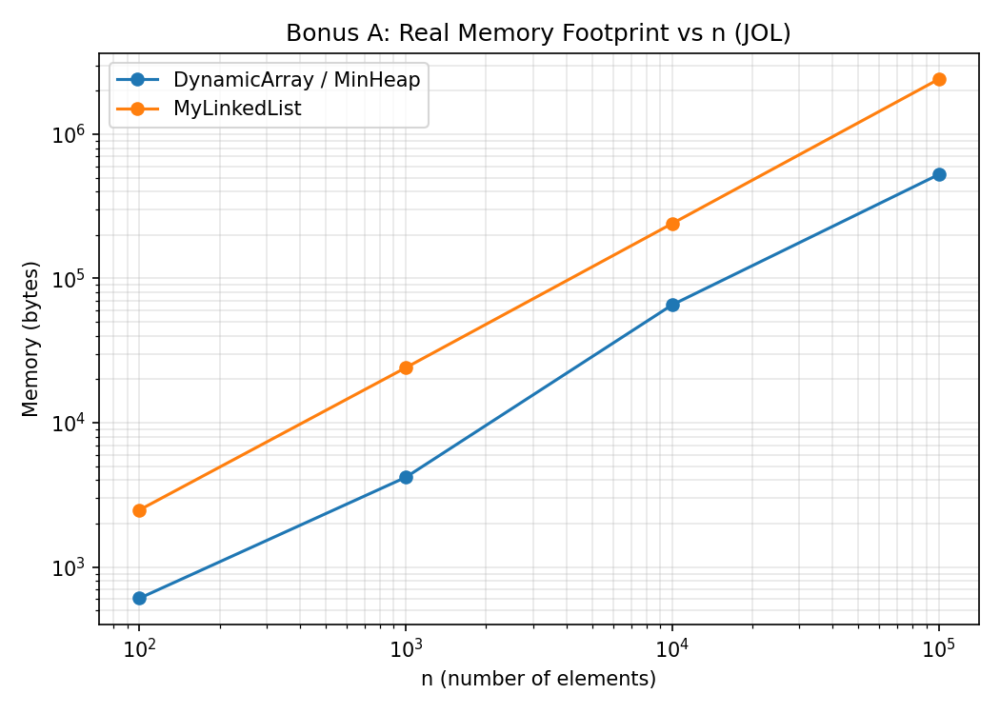

| Structure | n=100 | n=1,000 | n=10,000 | n=100,000 |
|---|---|---|---|---|
| DynamicArray | 608 B | 4,192 B | 65,632 B | 524,384 B |
| MinHeap | 608 B | 4,192 B | 65,632 B | 524,384 B |
| MyLinkedList | 2,488 B | 24,088 B | 240,088 B | 2,400,088 B |

DynamicArray and MinHeap report identical byte counts at every n — expected,
since both are built the same way internally (a single `int[]` plus a small
fixed amount of object overhead), just used differently.

The marginal cost per additional element is exactly **4 bytes** for
DynamicArray/MinHeap (matching `sizeof(int)` precisely — no per-element
overhead beyond the raw value itself, aside from occasional unused capacity
left over from the most recent doubling) versus exactly **24 bytes** per
element for MyLinkedList, consistently across every size I measured. That 24
bytes breaks down roughly as: a 12-16 byte object header every Java object
carries (mark word + compressed class pointer), + 4 bytes for the int value
itself, + 4 bytes for the compressed `next` reference, rounded up to the
nearest multiple of 8 for JVM memory alignment — giving a total of about 20-24
bytes of pure overhead on top of (or rather, wrapping around) each 4-byte int.

At n=100,000, this adds up to DynamicArray using about 0.5 MB versus
MyLinkedList using about 2.29 MB for the exact same 100,000 integers — the
list uses roughly **4.6x more memory**, entirely due to the per-node object
overhead the array simply never pays, since its elements live packed together
in one block with no individual object identity at all.

## 6. Bonus Task B — Floyd's O(n) buildHeap

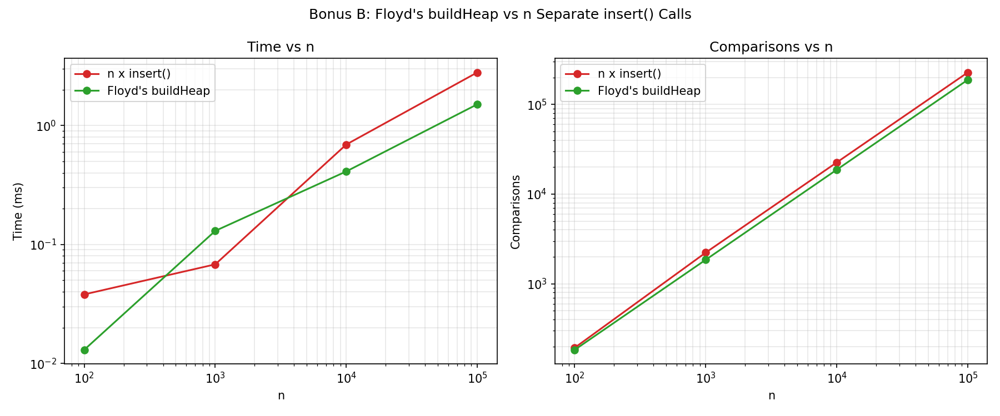

| n | insert×n time | Floyd time | insert×n comparisons | Floyd comparisons | insert×n moves | Floyd moves |
|---|---|---|---|---|---|---|
| 100 | 0.038ms | 0.013ms | 194 | 184 | 300 | 132 |
| 1,000 | 0.068ms | 0.130ms | 2,232 | 1,857 | 3,478 | 1,482 |
| 10,000 | 0.692ms | 0.411ms | 22,593 | 18,740 | 35,206 | 14,876 |
| 100,000 | 2.795ms | 1.508ms | 227,662 | 188,424 | 355,350 | 148,482 |

**Why Floyd's method is asymptotically faster:** calling `insert()` n times
costs O(n log n) in total, because each of the n insertions can bubble up as
far as the current tree's height (up to log n). Floyd's `buildHeap` instead
starts from an already-complete (but unordered) array and only calls
`bubbleDown` on internal nodes, working from the bottom up. More than half the
nodes are leaves and need zero work; the number of nodes at height `h` shrinks
geometrically while the maximum work per node grows only linearly with `h` —
the sum of (nodes at height h) × h across all heights converges to O(n) rather
than O(n log n).

**What the measurements show:** the comparison counts make the growth rate
difference clean and visible. Going from n=10,000 to n=100,000 (10x), Floyd's
comparisons grew from 18,740 to 188,424 — almost exactly 10.05x, i.e. linear,
matching the predicted O(n). The n-inserts method's comparisons grew from
22,593 to 227,662 in the same step — about 10.08x, only marginally
super-linear at this scale, though the gap becomes clearer earlier (from
n=100 to n=1,000, inserts grew 11.5x in comparisons against n growing 10x,
reflecting the extra log n factor more visibly at smaller heap heights). At
n=100,000, Floyd's method used about 17% fewer comparisons and 58% fewer
moves than n separate inserts, and ran about 1.85x faster in wall-clock time
(1.508ms vs 2.795ms).

One anomaly worth noting honestly: at n=1,000, Floyd's measured time
(0.130ms) was actually *higher* than the n-inserts time (0.068ms), despite
doing fewer comparisons and moves. I attribute this to JVM warm-up noise —
at this size, both methods complete in well under a millisecond, where
method-call overhead and JIT compilation timing can outweigh the actual
algorithmic difference. The comparison and move counts (which don't depend on
timing precision) are consistent with O(n) vs O(n log n) at every size,
including n=1,000, so I trust those over the noisy small-n timing.
